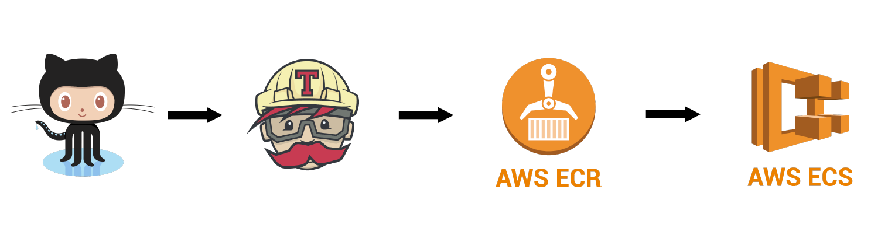

# PayPal Integration for Piggy Metrics

Our goal is to get a better understanding of microservice programming and implement a new service into piggymetrics, which allows users to login with their paypal account and track transactions made via paypal in their piggymetrics history.

## Functional services

PiggyMetrics was decomposed into three core microservices. All of them are independently deployable applications, organized around certain business domains. In this project we added a microservice that interacts with these core services to add PayPal Integration to PiggyMetrics.

### Account service
Contains general user input logic and validation: incomes/expenses items, savings and account settings.

### Statistics service
Performs calculations on major statistics parameters and captures time series for each account. Datapoint contains values, normalized to base currency and time period. This data is used to track cash flow dynamics in account lifetime.

### Notification service
Stores users contact information and notification settings (like remind and backup frequency). Scheduled worker collects required information from other services and sends e-mail messages to subscribed customers.

## PiggyPay
This is our new Microservice. It offers the user the ability to "Connect with Paypal". A user can choose to use the usual account service or to couple PiggyMetrics with PayPal. Users that use this new feature can login directly via Paypal and have access to their Paypal transaction details.

The Code Documentation for PiggyPal can be found [here](http://piggymetricsdocs.s3-website-us-east-1.amazonaws.com).

Method	| Path	| Description	| User authenticated	| Available from UI
------------- | ------------------------- | ------------- |:-------------:|:----------------:|
GET     | /                   | Get Paypal Login Button         | | x
GET     | /piggypal           | Get Paypal Transaction History  | |
GET     | /piggypal-listens   | Set Paypal Authorization code   | |
DELETE  | /piggypal-listens   | Returns current Authorization and erases confidential Information | |

#### Notes
A planned feature is to be able to see one's own PayPal account balance and have the transaction history taken into account when calculating statistics.

## Security

Communication with PayPal is secured via OAuth2 communication.
An advanced security configuration for the services running inside PiggyPal is beyond the scope of this proof-of-concept project.

## Infrastructure automation

The PiggyPal CI/CDE Pipeline looks as follows:

In this [configuration](https://github.com/bajo1207/piggymetrics/blob/master/.travis.yml), Travis CI builds tagged images for each successful git push to the master branch. We mainly made changes to our Piggypal service during this project, so we implemented our CI to update only the Piggypal Container, if other microservices remained unchanged.

## How to run all the things?

Keep in mind, that you are going to start 8 Spring Boot applications, 4 MongoDB instances, 3 CherryPy applications and RabbitMq. Make sure you have `4.5 Gb` RAM available on your machine. You can always run just vital services though: Gateway, Registry, Config, Auth Service, Account Service and PiggyPal.

#### Before you start
- You need Docker and Docker Compose.
- Change environment variable values in `.env` file for more security or leave it as it is (only applies to pure Piggymetrics).
- Make sure to build the Piggymetrics project firs: `mvn package [-DskipTests]`
- PiggyPal runs on Python. You don't need to compile it.

#### Production mode
In this mode, all latest images will be pulled from our container repository.
Just copy `docker-compose.yml` and hit `docker-compose up`

#### Development mode
If you'd like to build images yourself (with some changes in the code, for example), you have to clone all repository and build artifacts with maven. Then, run `docker-compose -f docker-compose.yml -f docker-compose.dev.yml up`

`docker-compose.dev.yml` inherits `docker-compose.yml` with additional possibility to build images locally and expose all containers ports for convenient development.

If you'd like to start applications in Intellij Idea you need to either use [EnvFile plugin](https://plugins.jetbrains.com/plugin/7861-envfile) or manually export environment variables listed in `.env` file (make sure they were exported: `printenv`)

#### Important endpoints
- http://localhost:80 - Gateway
- http://localhost:8761 - Eureka Dashboard
- http://localhost:9000/hystrix - Hystrix Dashboard (Turbine stream link: `http://turbine-stream-service:8080/turbine/turbine.stream`)
- http://localhost:15672 - RabbitMq management (default login/password: guest/guest)

#### Piggypal User Workflow
Piggypal is still unfinished. Thus you will run into some caveats if you try to use it as-is.  
Let's go through a request life-cycle so you know where your manual aid is needed:
1. Go through ["Before you start"](#before-you-start) and launch the services in [Production Mode](#production-mode) (as Development Mode is currently not supported by Piggypal)
2. Once all is running you can call <http://localhost:4710/>.  
There you will see the blue "Connect with Paypal" pill.  
(Including this button in the view is currently challenging, see [this issue](https://github.com/bajo1207/piggymetrics/issues/5), thus you have to take following workaround)  
3. With a click on the Paypal-Button you will be taken to a (sandboxed) login page.  
Please use credentials from your Sandbox/Paypal-Developer accounts to log in.
4. When running Paypal locally (with no externally reachable port) the specified Paypal returnURL is wrong.  
Please change the returnURL in the specific [gateway file](https://github.com/bajo1207/piggymetrics/blob/master/gateway/src/main/resources/static/login.html) to a dead end.  
After a short time of waiting, your browser will then return with an error. Now you are interested in the address bar which should state:  
`https://devtools-paypal.com/?code=<your Paypal authorization code>&scope=openid`
5. Remember your piggypal-service is running?  
You can now inject your auth code into piggpal-listens, e.g. via:  
`curl -vX PUT "http://localhost:4710/piggypal-listens?code=<your Paypal authorization code>&scope=openid"`  
Just replace `<your Paypal authorization code>` with your received auth-code.
6. Now you can do as many GET requests to the Paypal API which handles the transaction history through PiggyPal as you like. Just always provide a start- and end-date in Internet Date/Time format.  
You can look for more accepted arguments on the [Paypal Sync API Site](https://developer.paypal.com/docs/api/sync/v1/).  
A sample request might be:  
`curl -v "http://127.0.0.1:4710/piggypal?start_date=2019-12-01t00:00:01.0%2B00:00&end_date=2019-12-24t00:00:01.0-23:00"`  
(This returns all the great stuff (╯°□°）╯︵ ┻━┻ your sample account had to endure during christmas preparation time.)
7. The returned JSON is parsable and can be manually `PUT` into the [piggymetrics account service](https://github.com/sqshq/piggymetrics#account-service) of your account. (This will hopefully work automatically in the future...)  
This way piggymetrics can calculate statistics based on your paypal transaction history.  
(Helping you to fix ┬─┬ ノ( ゜-゜ノ) what you have lost in the most expensive time of the year)
8. If you are tired of manually injecting your details you are welcome help us develop these features...

#### Notes
All Spring Boot applications require already running [Config Server](https://github.com/sqshq/PiggyMetrics#config-service) for startup. But we can start all containers simultaneously because of `depends_on` docker-compose option.

Also, Service Discovery mechanism needs some time after all applications startup. Any service is not available for discovery by clients until the instance, the Eureka server and the client all have the same metadata in their local cache, so it could take 3 heartbeats. Default heartbeat period is 30 seconds.
